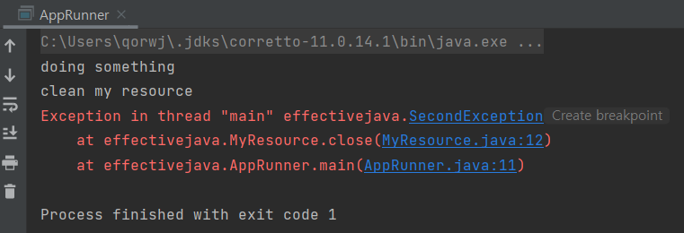
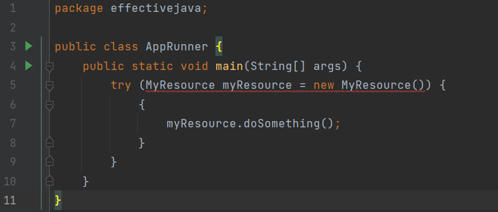
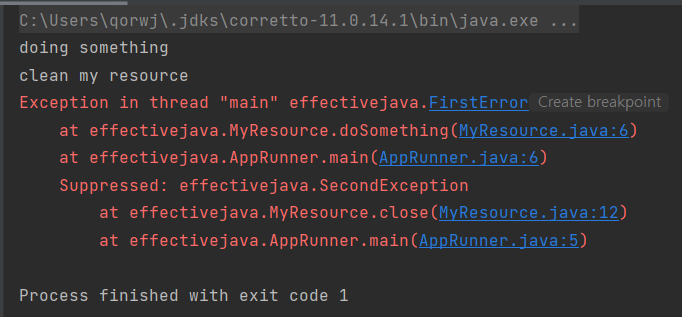

# 9장. Try-Finally 대신 Try-with-Resource 사용하라

자바 라이브러리에는`InputStream`,`OutputStream`그리고`java.sql.Connection`와 같이 close를 직접 호출해줘야하는 자원이 많다.
자원을 사용하는 클라이언트가 보통 리소스 정리를 잘 안하거나 잘못하는 경우가 있다.
그것에 대한 예시를 한번 살펴보자

## **Try-Finally** 예시

```java
package effectivejava;

public class FirstError extends RuntimeException {
}
```

```java
package effectivejava;

public class SecondException extends RuntimeException {
}
```

```java
package effectivejava;

public class MyResource {

    public void doSomething() throws FirstError {
        System.out.println("doing something");
        throw new FirstError();
    }

    public void close() throws SecondException {
        System.out.println("clean my resource");
        throw new SecondException();
    }
}
```

```java
package effectivejava;

public class AppRunner {
    public static void main(String[] args) {
        MyResource myResource = null;
        try {
            myResource = new MyResource();
            myResource.doSomething();
        } finally {
            if (myResource != null) {
                myResource.close();
            }
        }
    }
}
```



이 코드에서의 문제점을 살펴보면 다음과 같다.

AppRunner를 실행했을 때 myResource에서 doSomething()를 호출한다.
그리고 `FirstError`가 먼저 발생한 뒤 `SecondException`가 발생하는 것을 예상할 것이다. 
그러나 예외가 발생 시 사진에서 보이듯`SecondException`만 출력되고`FirstError`은 보이지 않는다. 
그러면 문제를 디버깅하기 힘들어 진다. 
또한 중복으로 try-catch를 만들어여 하는 경우에도 실수를 할 가능성이 높다.

## **Try-with-Resource 예시**

```java
package effectivejava;

public class AppRunner {
    public static void main(String[] args) {
        try (MyResource myResource = new MyResource()){ {
                myResource.doSomething();
            }
        }
    }
}
```



finally를 제거하고 try에 Resource를 ****넣어준다.
그러나 단순히 이것만 진행을 하면 Close가 없어 AutoCloseable을 이용하라는 에러가 나타난다.

```java
package effectivejava;

public class MyResource implements AutoCloseable{
    public void doSomething() throws FirstError {
        System.out.println("doing something");
        throw new FirstError();
    }

    @Override
    public void close() throws SecondException {
        System.out.println("clean my resource");
        throw new SecondException();
    }
}
```



자바7에 추가된 Try-with-Resource를 사용했을 때의 장점은 다음과 같다.

1. 코드 가독성도 좋다.
2. 문제를 분석할 때 좋다. 
(Try-Finally를 사용할 때 처럼 발생한 에러에 덮히지 않으니까 디버깅이 편리하다.)

뒤에 발생한 에러는 첫번째 발생한 에러 뒤에다 쌓아두고(suppressed) 처음 발생한 에러를 중요시 여긴다. 그리고`Throwable`의`getSuppressed`메소드를 사용해서 뒤에 쌓여있는 에러를 코딩으로 사용할 수도 있다.

Try-with-Resource에서도 Try-Finally처럼 catch를 사용할 수 있다.