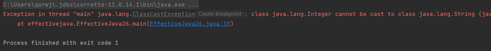

# 26장.raw type은 사용하지 말라

각각의 제네릭 타입은 일련의 매개변수화 타입을 정의한다. 

예를들어 List를 살펴보면 다음과 같다.

```java
List<Integer> list = new LinkedList<>();
```

먼저 클래스 이름이 나오고, 이어서 **꺽쇠괄호 안에 실제 타입 매개변수들**을 나열한다.

제네릭 타입을 하나 정의하면 그에 딸린 **raw type**도 함께 정의된다.

**raw type**이란 간단하게 보면 꺽쇠괄호가 사라진 형태라고 보면 된다.

```java
List list = new LinkedList();
```

### raw 타입을 사용하면 안되는 이유

왜 사용하면 안되는가에 대한 예시를 살펴보면 다음과 같다.

```java
package effectivejava;

import java.util.ArrayList;
import java.util.Iterator;
import java.util.List;

public class EffectiveJava26 {
    public static void main(String[] args) {
        List onlyString = new ArrayList();
        onlyString.add("이펙티브");
        onlyString.add("자바");
        onlyString.add(3);

        for (Iterator i = onlyString.iterator(); i.hasNext(); ) {
            String s = (String) i.next();
        }
    }
}
```

onlyString이라는 raw type인 List가 있다고 가정한다.

이때 추가하는 경우 “이펙티브”, “자바”, 3 의 값을 입력한다면 입력자체에 대한 오류 값은 나타나지 않는 **컴파일 시점에 에러를 잡을 수가 없다.**

실제로 값을 가져와서 캐스팅을 하는 시점에 컴파일러는 ClassCastException을 던진다.



그래서 우리는 매개변수화된 타입을 사용함으로써 컴파일시에 나타나는 에러를 찾아내 오류를 방지할 수 있다.

## **제너릭이더라도 무조건 안전하지 않다.**

컬렉션이 파라미터화되어 선언되었더라도, 컬렉션을 인자로 받는 메서드의 파라미터가 raw type이라면 런타임 오류가 발생할 수 있다.

```java
public static void main(String[] args) {
		List<String> strings = new ArrayList<>();
		unsafeAdd(strings, Integer.valueOf(42));
		String s = strings.get(0); // 런타임 에러, class java.lang.Integer cannot be cast to class java.lang.String
	}

	private static void unsafeAdd(List list, Object o) {
		list.add(o);
	}
```

그럼에도 불구하고 우리는 여러가지 타입을 받으면서 타입에 대해서 신경쓰고 싶지 않을 수 있다.

그럴때는 비한정적 와일드 카드 타입(unbounded wildcard type)을 사용하자.

```java
static int numElementsInCommon(Set<?> s1, Set<?> s2) { ... } <- ?가 와일드카드
```